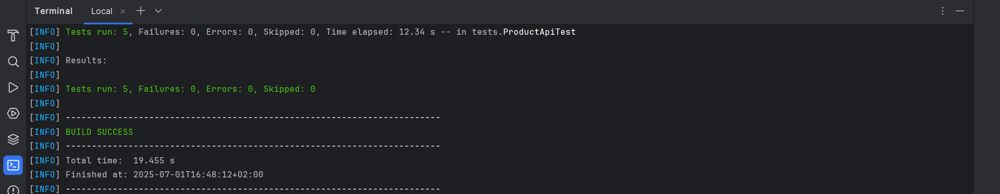

# 🚀 API Automation Tests

## 📝 Overview
This project contains automated API tests for product management endpoints.  
The tests cover CRUD operations and schema validations to ensure the API behaves as expected.

## 🛠 Technologies Used
- 🟩 **Java 21**
- 🧪 **JUnit 5** (testing framework)
- 🌐 **RestAssured** (API testing)
- ✔️ **AssertJ** (assertions)
- 📄 **JSON Schema Validator** (response schema validation)
- ⚙️ **Maven** (build and dependency management)

## ▶️ How to Run Tests Locally

1. **Clone the repository:**
   ```bash
   git clone https://github.com/adesz0112/api_automation_task
   cd api_automation_task

2. **Make sure Java 21 and Maven are installed and configured in your PATH.**

3. **Run the tests using Maven:**
    ```bash
   mvn clean test

## ✅ Test Results
A screenshot of the test results is included below for your reference:



